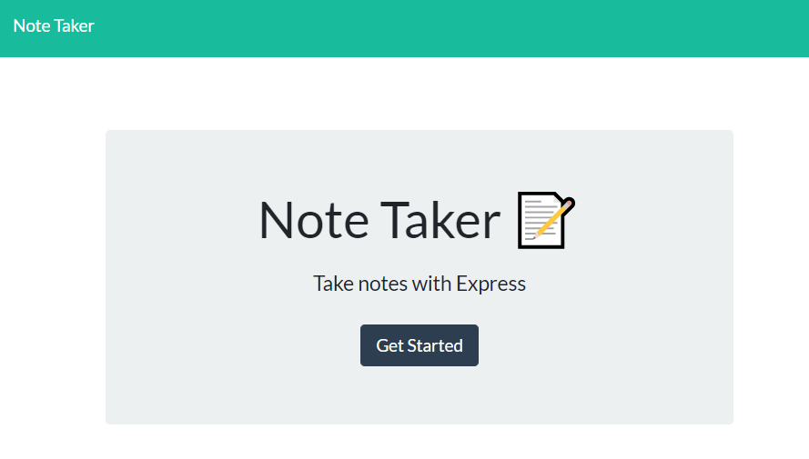
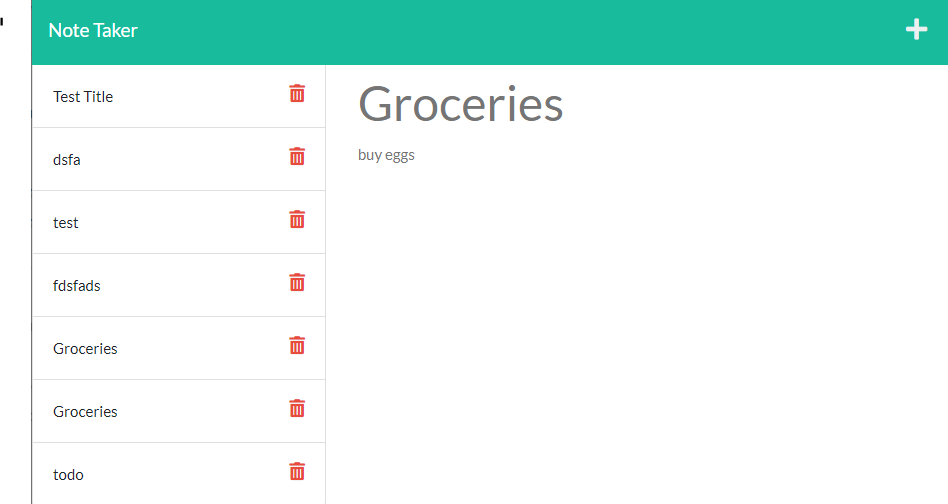
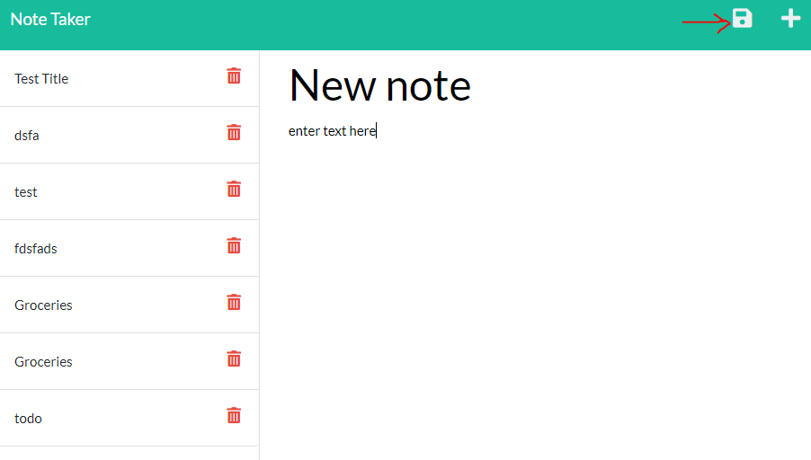

# note-taker

## Description
This is a note taking app using NPM, Express and javascript to allow the user to record and store notes on the webpage. The page is powered by Heroku.

## Installation
- Run NPM install for express as the node_modules is not included/tracked. Type "npm i express" in your console.

## Usage
1. point your browser to <a href="https://damp-anchorage-79022.herokuapp.com/">Note Taker</a>
    and click "Get Started".    

    

2. Review current notes or create new notes, and click the save icon.

    
    

3. Press the Delete Button to Remove notes (WIP)

    <!--  -->

## Issues
1. Delete button does not work. 

## Credits

Special Thanks to my friend <a href="https://github.com/zzangu0215">Jun Park.</a>

